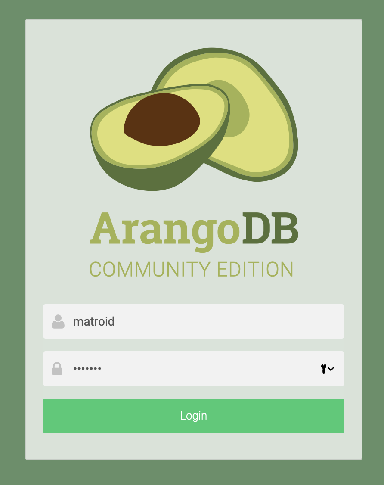
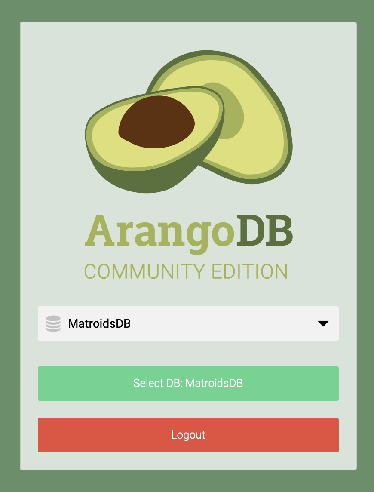
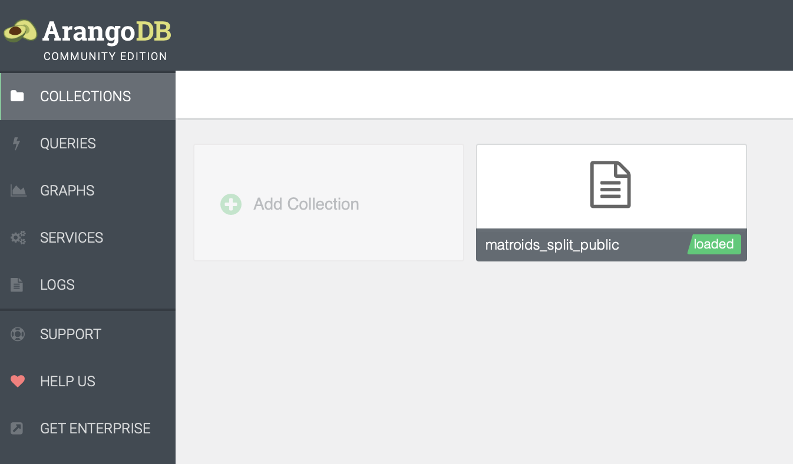
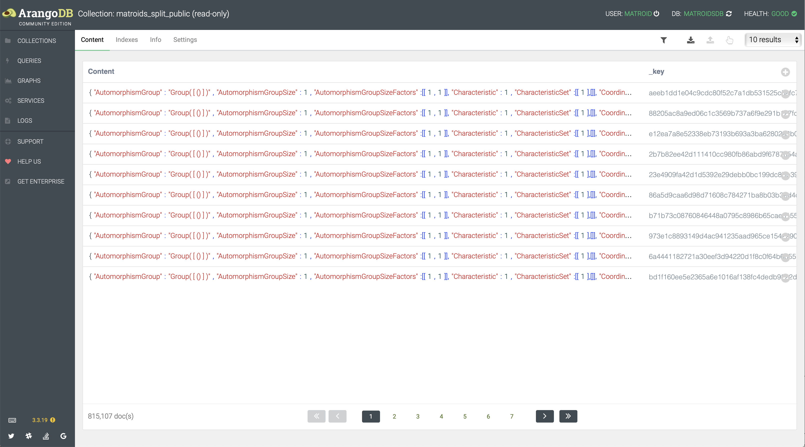
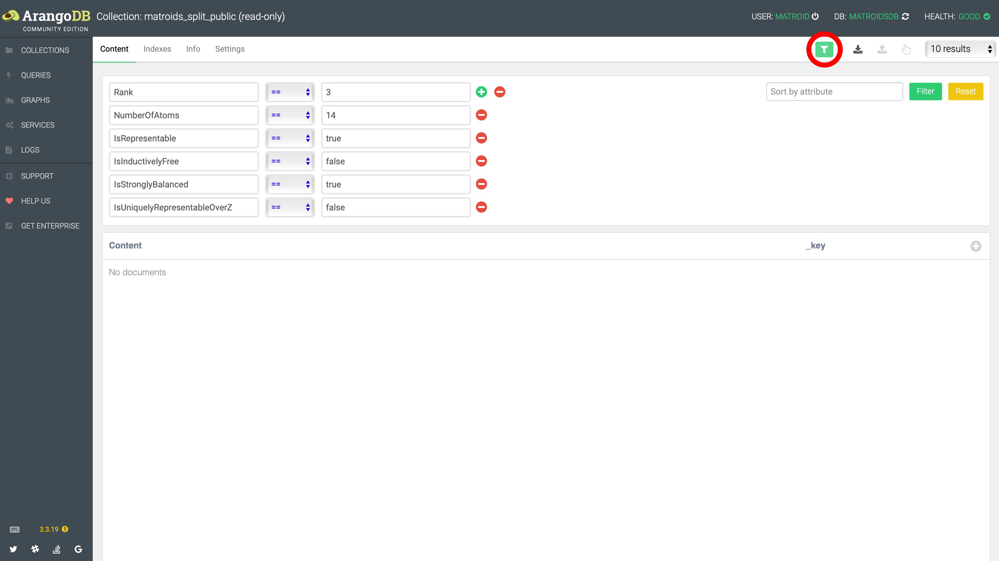
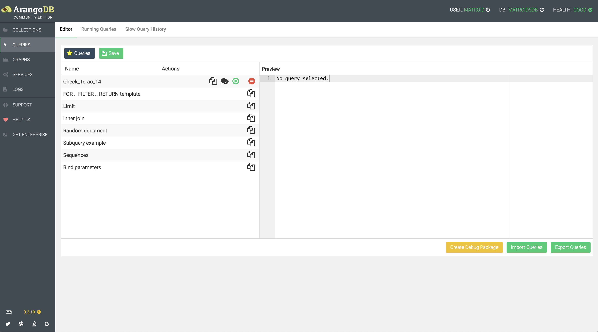
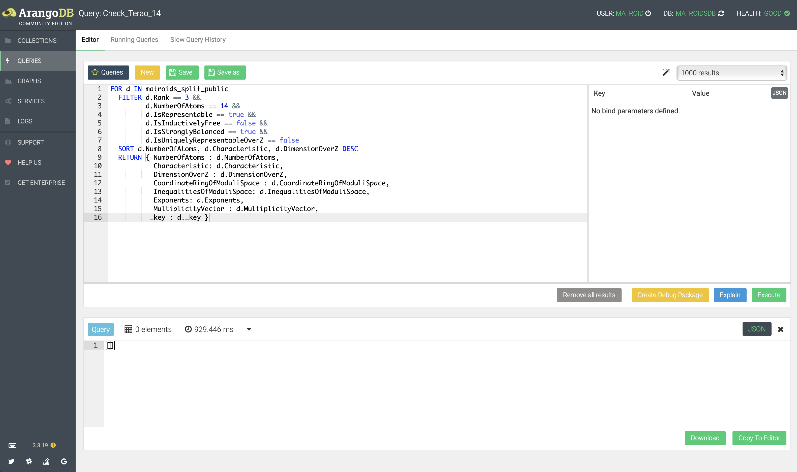

# MatroidGeneration – Generate low-rank matroids

| **Documentation**                       |
|:---------------------------------------:|
| [![][docs-stable-img]][docs-stable-url] |

[docs-stable-img]: https://img.shields.io/badge/docs-stable-blue.svg
[docs-stable-url]: https://homalg-project.github.io/MatroidGeneration/doc/chap0.html

This GAP package was used to create the [publicly available](https://matroid.mathematik.uni-siegen.de/) read-only ArangoDB collection `matroids_split_public`.

#### Table of contents

* [Construct a matroid from the database and find the database key of a matroid](#construct-a-matroid-from-the-database-and-find-the-database-key-of-a-matroid)
* [Accessing the collection through the web interface](#accessing-the-collection-through-the-web-interface)
* [Accessing the collection through GAP](#accessing-the-collection-through-gap)
* [Content of the collection](#content-of-the-collection)
* [Verifying Terao's freeness conjecture for rank 3 matroids with 14 atoms](#verifying-teraos-freeness-conjecture-for-rank-3-matroids-with-14-atoms)
  * [in the web interface using filters](#in-the-web-interface-using-filters)
  * [in the web interface using a query](#in-the-web-interface-using-a-query)
  * [in GAP](#in-gap)

## Construct a matroid from the database and find the database key of a matroid

```gap
gap> LoadPackage( "MatroidGeneration" );
true
gap> db := AttachMatroidsDatabase();
#I  Connecting to http+ssl://matroid.mathematik.uni-siegen.de:443
[object ArangoDatabase "MatroidsDB"]
gap> sha := "ef53049d834fba1b21f36c365d7f1d46d7fce2f2";;
gap> d := db.matroids_split_public.document( sha );
[ArangoDocument]
gap> matroid := MatroidByCoatomsNC( d );
<A matroid>
gap> coatoms := MinimalListOfCoatoms( matroid );
[ [ 1, 2, 3, 4, 5 ], [ 1, 6, 7, 8, 9 ], [ 1, 10, 11, 12 ], [ 2, 6, 10, 13 ],
  [ 2, 7, 11, 14 ], [ 3, 6, 12, 14 ], [ 3, 8, 11, 13 ], [ 4, 9, 10, 14 ],
  [ 4, 7, 13 ], [ 5, 7, 12 ], [ 5, 8, 10 ], [ 5, 9, 11 ], [ 5, 13, 14 ],
  [ 9, 12, 13 ], [ 1, 13 ], [ 1, 14 ], [ 2, 8 ], [ 2, 9 ], [ 2, 12 ],
  [ 3, 7 ], [ 3, 9 ], [ 3, 10 ], [ 4, 6 ], [ 4, 8 ], [ 4, 11 ],
  [ 4, 12 ], [ 5, 6 ], [ 6, 11 ], [ 7, 10 ], [ 8, 12 ], [ 8, 14 ] ]
gap> ShaSum( String( coatoms ) ) = sha;
true
```

## Accessing the collection through the web interface

The collection can be accessed through the publicly available ArangoDB web interface:

|           | credentials                                                                            |
|-----------|----------------------------------------------------------------------------------------|
|server	    | [https://matroid.mathematik.uni-siegen.de/](https://matroid.mathematik.uni-siegen.de/) |
|username   | matroid                                                                                |
|password   | matroid                                                                                |
|database   | MatroidsDB                                                                             |
|collection | matroids_split_public                                                                  |

<p>

</p>
<p>

</p>
<p>

</p>
<p>

</p>

## Accessing the collection through GAP

The package can also be used to access the collection directly.

1. First start `gap` and make sure you can
```gap
gap> LoadPackage( "MatroidGeneration" );
───────────────────────────────────────────────────────────────────────────────────────────────────────────────────────────────────────────────────────────────────────────────
Loading  ferret 1.0.2 (Backtrack Search in Permutation Groups)
by Christopher Jefferson (http://caj.host.cs.st-andrews.ac.uk/).
Homepage: https://gap-packages.github.io/ferret/
Report issues at https://github.com/gap-packages/ferret/issues
───────────────────────────────────────────────────────────────────────────────────────────────────────────────────────────────────────────────────────────────────────────────
───────────────────────────────────────────────────────────────────────────────────────────────────────────────────────────────────────────────────────────────────────────────
Loading  Gauss 2020.06.27 (Extended Gauss functionality for GAP)
by Simon Görtzen (https://www.linkedin.com/in/simongoertzen/).
maintained by:
   Mohamed Barakat (https://mohamed-barakat.github.io) and
   Sebastian Gutsche (https://sebasguts.github.io).
Homepage: https://homalg-project.github.io/homalg_project/Gauss/
Report issues at https://github.com/homalg-project/homalg_project/issues
───────────────────────────────────────────────────────────────────────────────────────────────────────────────────────────────────────────────────────────────────────────────
───────────────────────────────────────────────────────────────────────────────────────────────────────────────────────────────────────────────────────────────────────────────
Loading  json 2.0.1 (Reading and Writing JSON)
by Christopher Jefferson (http://caj.host.cs.st-andrews.ac.uk/).
Homepage: https://gap-packages.github.io/json/
Report issues at https://github.com/gap-packages/json/issues
───────────────────────────────────────────────────────────────────────────────────────────────────────────────────────────────────────────────────────────────────────────────
───────────────────────────────────────────────────────────────────────────────────────────────────────────────────────────────────────────────────────────────────────────────
Loading  ToolsForHomalg 2020.05.12 (Provides special methods and knowledge propagation tools)
by Mohamed Barakat (https://mohamed-barakat.github.io),
   Sebastian Gutsche (https://sebasguts.github.io), and
   Markus Lange-Hegermann (http://wwwb.math.rwth-aachen.de/~markus/).
Homepage: https://homalg-project.github.io/homalg_project/ToolsForHomalg/
Report issues at https://github.com/homalg-project/homalg_project/issues
───────────────────────────────────────────────────────────────────────────────────────────────────────────────────────────────────────────────────────────────────────────────
───────────────────────────────────────────────────────────────────────────────────────────────────────────────────────────────────────────────────────────────────────────────
Loading  images 1.3.0 (Minimal and Canonical images)
by Christopher Jefferson (http://caj.host.cs.st-andrews.ac.uk/),
   Markus Pfeiffer (http://www.morphism.de/~markusp/),
   Rebecca Waldecker (http://conway1.mathematik.uni-halle.de/~waldecker/), and
   Eliza Jonauskyte (ej31@st-andrews.ac.uk).
maintained by:
   Christopher Jefferson (http://caj.host.cs.st-andrews.ac.uk/).
Homepage: https://gap-packages.github.io/images/
Report issues at https://github.com/gap-packages/images/issues
───────────────────────────────────────────────────────────────────────────────────────────────────────────────────────────────────────────────────────────────────────────────
───────────────────────────────────────────────────────────────────────────────────────────────────────────────────────────────────────────────────────────────────────────────
Loading  MatricesForHomalg 2020.06.30 (Lazy evaluated matrices with clever operations for the homalg project)
by Mohamed Barakat (https://mohamed-barakat.github.io),
   Markus Lange-Hegermann (https://www.th-owl.de/eecs/fachbereich/team/markus-lange-hegermann/),
   Martin Leuner (http://wwwb.math.rwth-aachen.de/Mitarbeiter/leuner.php), and
   Vinay Wagh (http://www.iitg.ernet.in/vinay.wagh/).
maintained by:
   Mohamed Barakat (https://mohamed-barakat.github.io).
Homepage: https://homalg-project.github.io/homalg_project/MatricesForHomalg/
Report issues at https://github.com/homalg-project/homalg_project/issues
───────────────────────────────────────────────────────────────────────────────────────────────────────────────────────────────────────────────────────────────────────────────
───────────────────────────────────────────────────────────────────────────────────────────────────────────────────────────────────────────────────────────────────────────────
Loading  ParallelizedIterators 2019.06.06 (Parallely evaluate recursive iterators)
by Mohamed Barakat (https://mohamed-barakat.github.io),
   Reimer Behrends (https://github.com/rbehrends), and
   Lukas Kühne (https://github.com/lukaskuehne).
Homepage: https://homalg-project.github.io/ParallelizedIterators
Report issues at https://github.com/homalg-project/ParallelizedIterators/issues
───────────────────────────────────────────────────────────────────────────────────────────────────────────────────────────────────────────────────────────────────────────────
───────────────────────────────────────────────────────────────────────────────────────────────────────────────────────────────────────────────────────────────────────────────
Loading  GaussForHomalg 2020.06.27 (Gauss functionality for the homalg project)
by Simon Görtzen (https://www.linkedin.com/in/simongoertzen/).
maintained by:
   Mohamed Barakat (https://mohamed-barakat.github.io).
Homepage: https://homalg-project.github.io/homalg_project/GaussForHomalg/
Report issues at https://github.com/homalg-project/homalg_project/issues
───────────────────────────────────────────────────────────────────────────────────────────────────────────────────────────────────────────────────────────────────────────────
───────────────────────────────────────────────────────────────────────────────────────────────────────────────────────────────────────────────────────────────────────────────
Loading  HomalgToCAS 2020.06.27 (A window to the outer world)
by Thomas Bächler (http://wwwb.math.rwth-aachen.de/~thomas/),
   Mohamed Barakat (https://mohamed-barakat.github.io),
   Simon Görtzen (https://www.linkedin.com/in/simongoertzen/),
   Sebastian Gutsche (https://sebasguts.github.io), and
   Vinay Wagh (http://www.iitg.ernet.in/vinay.wagh/).
with contributions by:
   Thomas Breuer (http://www.math.rwth-aachen.de/~Thomas.Breuer/) and
   Frank Lübeck (http://www.math.rwth-aachen.de/~Frank.Luebeck/).
maintained by:
   Mohamed Barakat (https://mohamed-barakat.github.io).
Homepage: https://homalg-project.github.io/homalg_project/HomalgToCAS/
Report issues at https://github.com/homalg-project/homalg_project/issues
───────────────────────────────────────────────────────────────────────────────────────────────────────────────────────────────────────────────────────────────────────────────
───────────────────────────────────────────────────────────────────────────────────────────────────────────────────────────────────────────────────────────────────────────────
Loading  IO_ForHomalg 2020.04.30 (IO capabilities for the homalg project)
by Thomas Bächler (http://wwwb.math.rwth-aachen.de/~thomas/),
   Mohamed Barakat (https://mohamed-barakat.github.io),
   Sebastian Gutsche (https://algebra.mathematik.uni-siegen.de/gutsche/),
   Max Neunhöffer (http://www-groups.mcs.st-and.ac.uk/~neunhoef/), and
   Daniel Robertz (http://wwwb.math.rwth-aachen.de/~daniel/).
maintained by:
   Mohamed Barakat (https://mohamed-barakat.github.io).
Homepage: https://homalg-project.github.io/homalg_project/IO_ForHomalg/
Report issues at https://github.com/homalg-project/homalg_project/issues
───────────────────────────────────────────────────────────────────────────────────────────────────────────────────────────────────────────────────────────────────────────────
───────────────────────────────────────────────────────────────────────────────────────────────────────────────────────────────────────────────────────────────────────────────
Loading  RingsForHomalg 2020.06.30 (Dictionaries of external rings for the homalg project)
by Mohamed Barakat (https://mohamed-barakat.github.io),
   Simon Görtzen (https://www.linkedin.com/in/simongoertzen/),
   Markus Kirschmer (http://www.math.rwth-aachen.de/~Markus.Kirschmer/),
   Markus Lange-Hegermann (https://www.th-owl.de/eecs/fachbereich/team/markus-lange-hegermann/),
   Oleksandr Motsak (http://www.mathematik.uni-kl.de/~motsak/),
   Daniel Robertz (http://wwwb.math.rwth-aachen.de/~daniel/),
   Hans Schönemann (http://www.mathematik.uni-kl.de/~hannes/),
   Andreas Steenpaß (steenpass@mathematik.uni-kl.de), and
   Vinay Wagh (http://www.iitg.ernet.in/vinay.wagh/).
with contributions by:
   Max Neunhöffer (http://www-groups.mcs.st-and.ac.uk/~neunhoef/).
maintained by:
   Mohamed Barakat (https://mohamed-barakat.github.io).
Homepage: https://homalg-project.github.io/homalg_project/RingsForHomalg/
Report issues at https://github.com/homalg-project/homalg_project/issues
───────────────────────────────────────────────────────────────────────────────────────────────────────────────────────────────────────────────────────────────────────────────
───────────────────────────────────────────────────────────────────────────────────────────────────────────────────────────────────────────────────────────────────────────────
Loading  ArangoDBInterface 2020.04.16 (An interface to ArangoDB)
by Mohamed Barakat (https://mohamed-barakat.github.io/).
Homepage: https://homalg-project.github.io/ArangoDBInterface
Report issues at https://github.com/homalg-project/ArangoDBInterface/issues
───────────────────────────────────────────────────────────────────────────────────────────────────────────────────────────────────────────────────────────────────────────────
───────────────────────────────────────────────────────────────────────────────────────────────────────────────────────────────────────────────────────────────────────────────
Loading  alcove 2019-09-01 (alcove - Objects in Algebraic Combinatorics)
by Martin Leuner (http://wwwb.math.rwth-aachen.de/~leuner/).
Homepage: https://github.com/martin-leuner/alcove
───────────────────────────────────────────────────────────────────────────────────────────────────────────────────────────────────────────────────────────────────────────────
───────────────────────────────────────────────────────────────────────────────────────────────────────────────────────────────────────────────────────────────────────────────
Loading  MatroidGeneration 2019.06.14 (Generate low-rank matroids)
by Mohamed Barakat (https://mohamed-barakat.github.io/) and
   Lukas Kühne (https://github.com/lukaskuehne).
Homepage: https://homalg-project.github.io/MatroidGeneration
Report issues at https://github.com/homalg-project/MatroidGeneration/issues
───────────────────────────────────────────────────────────────────────────────────────────────────────────────────────────────────────────────────────────────────────────────
true
```
`MatroidGeneration` recursively depends on the above packages, which can all be downloaded
from [https://github.com/homalg-project/](https://github.com/homalg-project/).

2. Then attach the database `MatroidsDB`:
```gap
gap> db := AttachMatroidsDatabase();
#I  Connecting to http+ssl://matroid.mathematik.uni-siegen.de:443
================================================================

                                       _
  __ _ _ __ __ _ _ __   __ _  ___  ___| |__
 / _` | '__/ _` | '_ \ / _` |/ _ \/ __| '_ \
| (_| | | | (_| | | | | (_| | (_) \__ \ | | |
 \__,_|_|  \__,_|_| |_|\__, |\___/|___/_| |_|
                       |___/

arangosh (ArangoDB 3.4.5 [darwin] 64bit, using jemalloc, build , VPack 0.1.33, RocksDB 5.16.0, ICU 58.1, V8 5.7.492.77, OpenSSL 1.0.2r  26 Feb 2019)
Copyright (c) ArangoDB GmbH

Command-line history will be persisted when the shell is exited.
Connected to ArangoDB 'http+ssl://matroid.mathematik.uni-siegen.de:443' version: 3.3.19 [UNKNOWN, server], database: 'MatroidsDB', username: 'matroid'

Type 'tutorial' for a tutorial or 'help' to see common examples

================================================================
[object ArangoDatabase "MatroidsDB"]
gap> ?QueryDatabase
```

## Content of the collection

The database collection `matroids_split_public` contains the values of the following keys:
* Rank
* NumberOfAtoms
* Characteristic
* Exponents
* AutomorphismGroup
* AutomorphismGroupSize
* AutomorphismGroupSizeFactors
* CharacteristicSet
* CoordinateRingOfModuliSpace
* DimensionOverZ
* DressWenzelCondition
* InequalitiesOfModuliSpace
* IsBalanced
* IsCharPolyIntegrallySplitting
* IsDivisionallyFree
* IsEssentiallyUniquelyRepresentableOverZ
* IsFactored
* IsInductivelyFree
* IsRepresentable
* IsSimplicial
* IsSupersolvable
* IsTutteUnique
* IsUniquelyRepresentableOverZ
* IsStronglyBalanced
* ListOfCoatoms
* MatrixOfVectorMatroid
* MultiplicityVector
* TuttePolynomial

## Verifying Terao's freeness conjecture for rank 3 matroids with 14 atoms

The first intended use case is to verify Terao's freeness conjecture for rank 3 matroids with 14 atoms.
This can be either done by a query in the web interface or in GAP.

For details see our paper "[On the generation of rank 3 simple matroids with an application to Terao's freeness conjecture](http://arxiv.org/abs/1907.01073)".

### in the web interface using filters
After choosing the collection `COLLECTION > matroids_split_public` press filter button
and enter the following filter values (which will be combined with the AND connective)
```
Rank == 3
NumberOfAtoms == 14
IsRepresentable == true
IsInductivelyFree == false
IsStronglyBalanced == true
IsUniquelyRepresentableOverZ == false
```
and then press ENTER. The result will be `No documents`.

<p>

</p>

### in the web interface using a query
There should be a predefined query `QUERIES > Queries > Check_Terao_14` which upon execution
returns an empty list.
Here is its content, also in case it was accidentally deleted or modified by another user:
```
FOR d IN matroids_split_public
  FILTER d.Rank == 3 &&
         d.NumberOfAtoms == 14 &&
         d.IsRepresentable == true &&
         d.IsInductivelyFree == false &&
         d.IsStronglyBalanced == true &&
         d.IsUniquelyRepresentableOverZ == false
  SORT d.NumberOfAtoms, d.Characteristic, d.DimensionOverZ DESC
  RETURN { NumberOfAtoms : d.NumberOfAtoms,
           Characteristic: d.Characteristic,
           DimensionOverZ : d.DimensionOverZ,
           CoordinateRingOfModuliSpace : d.CoordinateRingOfModuliSpace,
           InequalitiesOfModuliSpace: d.InequalitiesOfModuliSpace,
           Exponents: d.Exponents,
           MultiplicityVector : d.MultiplicityVector,
          _key : d._key }
```
<p>

</p>
<p>

</p>

### in GAP
```gap
gap> LoadPackage( "MatroidGeneration" );
true
gap> db := AttachMatroidsDatabase();
#I  Connecting to http+ssl://matroid.mathematik.uni-siegen.de:443
[object ArangoDatabase "MatroidsDB"]
gap> q := QueryDatabase( rec(
>      	  Rank := 3,
>      	  NumberOfAtoms := 14,
>      	  IsRepresentable := true,
>	  IsInductivelyFree := false,
>	  IsStronglyBalanced := true,
>	  IsUniquelyRepresentableOverZ := false ),
> db.matroids_split_public );
[ArangoQueryCursor in [object ArangoDatabase "MatroidsDB"]]
gap> q.count();
0
```
